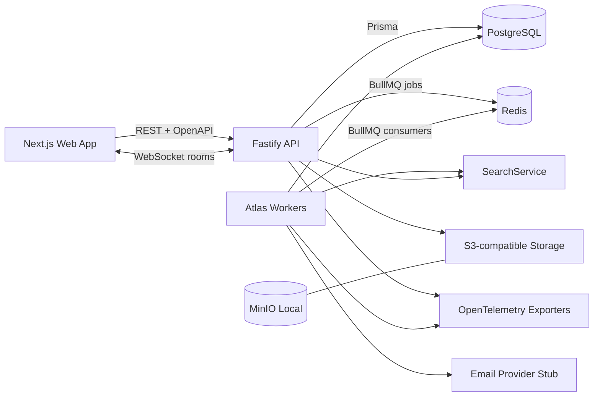
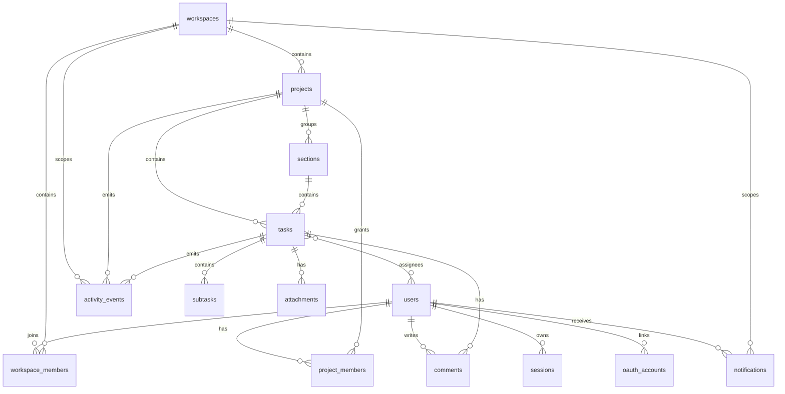
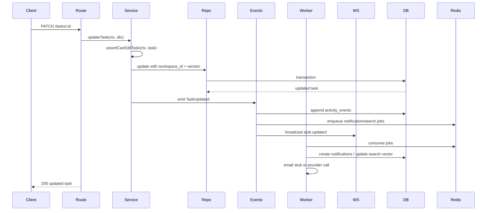

# Atlas Foundation Architecture

Atlas is a multi-tenant project-management platform for workspaces, projects, tasks, collaboration, notifications, and search. This document defines the foundation layer only: domain model, tenancy, permissions, API boundaries, event flow, and infrastructure shape that future feature work will build on.

## System Context



Local development runs PostgreSQL, Redis, MinIO, the API, workers, and the web shell through Docker Compose. Production/staging infrastructure is represented by Terraform modules with managed equivalents: RDS PostgreSQL, ElastiCache Redis, S3, container runtime, secrets, and observability exporters.

## Monorepo Shape

```text
apps/
  api/          # Fastify REST API, WebSocket gateway, OpenAPI
  web/          # Next.js App Router shell
packages/
  db/           # Prisma schema, migrations, seed
  shared/       # DTOs, Zod schemas, constants, event types
  config/       # shared tsconfig, eslint, prettier/test config
infra/
  docker/       # Dockerfiles and local service config
  terraform/    # staging-ready AWS modules
docs/
  decisions/    # ADRs
```

## Domain Model



Core entities use UUID primary keys, `workspace_id` where tenant scoping is required, `created_at`, `updated_at`, and `deleted_at` for soft delete. Mutation-heavy entities also carry a monotonically increasing `version` for optimistic concurrency.

### Entities

- `users`: identity profile, email, password hash, status, timestamps.
- `sessions`: refresh-token family, hashed refresh token, device metadata, revoked timestamp, expiry.
- `oauth_accounts`: OAuth-ready identity links by provider and provider account id.
- `workspaces`: tenant root, name, slug, owner, soft-delete fields.
- `workspace_members`: membership and role: `OWNER`, `ADMIN`, `MEMBER`, `GUEST`.
- `projects`: workspace-scoped project; visibility `WORKSPACE` or `PRIVATE`; archived and soft-delete fields.
- `project_members`: explicit project access for private projects and elevated project roles.
- `sections`: project columns/lists with sortable `position`.
- `tasks`: workspace/project scoped work item with title, description, status, priority, due date, section, position, version.
- `task_assignees`: many-to-many task assignments with idempotent unique key.
- `subtasks`: one-level children of tasks for MVP, no nested subtasks.
- `comments`: task comments with author and soft-delete fields.
- `attachments`: metadata only; object key points to S3-compatible storage.
- `activity_events`: append-only audit trail for task/project/workspace events.
- `notifications`: in-app notifications and delivery state; email delivery is job-backed and stubbed.

## Tenancy Model

Every tenant-owned table includes `workspace_id`, either directly or through an enforced parent relationship. Service-layer APIs must receive an authenticated principal and an explicit `workspaceId`; repositories never expose unscoped "global" list methods for tenant data.

Isolation rules:

- All workspace, project, task, comment, activity, notification, and search queries are scoped by `workspace_id`.
- Private project checks require both workspace membership and project membership.
- Soft-deleted rows are excluded by default in repositories.
- Cross-workspace references are rejected before writes, including moving tasks, assigning users, and creating comments.
- Background jobs include `workspaceId` in payloads and re-check access-relevant entity existence before side effects.

Database foreign keys enforce structural consistency. Service-layer guards enforce tenancy intent and role permissions. Optional PostgreSQL row-level security is deferred until after the application service layer is stable.

## Auth Model

Atlas starts with email/password and an OAuth-ready account structure.

- Access token: short-lived JWT, signed by API secret or asymmetric key in production.
- Refresh token: opaque random token stored hashed in `sessions`.
- Refresh rotation: each refresh invalidates the previous token in the same session family.
- Session invalidation: logout revokes one session; future endpoint can revoke all sessions for a user.
- Password hashing: Argon2id.
- Rate limits: stricter limits on register, login, refresh, and writes; keyed by user id when authenticated and IP otherwise.

Auth context available to services:

```ts
type AuthContext = {
  userId: string;
  sessionId: string;
  workspaceId?: string;
  ip: string;
  userAgent?: string;
};
```

## Permission Matrix

Workspace roles are the baseline. Project roles refine access for private projects and project administration.

### Workspace Permissions

| Action | Owner | Admin | Member | Guest |
| --- | --- | --- | --- | --- |
| Read workspace | Yes | Yes | Yes | Yes |
| Update workspace settings | Yes | Yes | No | No |
| Delete workspace | Yes | No | No | No |
| Invite members | Yes | Yes | No | No |
| Change member roles | Yes | Yes, except Owner | No | No |
| Remove members | Yes | Yes, except Owner | No | No |
| Create workspace-visible project | Yes | Yes | Yes | No |
| Read workspace-visible project | Yes | Yes | Yes | Yes |
| Search workspace | Yes | Yes | Yes | Limited to accessible projects |
| View audit/activity | Yes | Yes | Project-scoped | Project-scoped |

### Project Permissions

Project roles: `PROJECT_ADMIN`, `EDITOR`, `COMMENTER`, `VIEWER`.

| Action | Workspace Owner/Admin | Project Admin | Editor | Commenter | Viewer |
| --- | --- | --- | --- | --- | --- |
| Read project | Yes | Yes | Yes | Yes | Yes |
| Update project settings | Yes | Yes | No | No | No |
| Archive project | Yes | Yes | No | No | No |
| Manage project members | Yes | Yes | No | No | No |
| Create/update/reorder sections | Yes | Yes | Yes | No | No |
| Create/update/move/complete tasks | Yes | Yes | Yes | No | No |
| Assign/unassign tasks | Yes | Yes | Yes | No | No |
| Create/update own comments | Yes | Yes | Yes | Yes | No |
| Delete any comment | Yes | Yes | No | No | No |
| Upload attachments | Yes | Yes | Yes | No | No |

Workspace-visible projects grant default `VIEWER` access to workspace guests and default `EDITOR` access to workspace members unless the project has explicit project-member overrides. Private projects require explicit `project_members` access or workspace Owner/Admin role.

Every public service method must begin with a permission guard. API routes are thin transport adapters and do not own authorization.

## API Surface Overview

REST is the first API surface. OpenAPI is generated from route schemas and published at `/docs/openapi.json` with Swagger UI available in non-production environments.

Base path: `/api/v1`.

### Auth

- `POST /auth/register`
- `POST /auth/login`
- `POST /auth/refresh`
- `POST /auth/logout`
- `GET /auth/me`

### Workspaces

- `POST /workspaces`
- `GET /workspaces`
- `GET /workspaces/:workspaceId`
- `PATCH /workspaces/:workspaceId`
- `DELETE /workspaces/:workspaceId`
- `POST /workspaces/:workspaceId/invitations`
- `GET /workspaces/:workspaceId/members`
- `PATCH /workspaces/:workspaceId/members/:memberId`
- `DELETE /workspaces/:workspaceId/members/:memberId`

### Projects

- `POST /workspaces/:workspaceId/projects`
- `GET /workspaces/:workspaceId/projects`
- `GET /workspaces/:workspaceId/projects/:projectId`
- `PATCH /workspaces/:workspaceId/projects/:projectId`
- `POST /workspaces/:workspaceId/projects/:projectId/archive`
- `DELETE /workspaces/:workspaceId/projects/:projectId`

### Sections

- `POST /workspaces/:workspaceId/projects/:projectId/sections`
- `GET /workspaces/:workspaceId/projects/:projectId/sections`
- `PATCH /workspaces/:workspaceId/projects/:projectId/sections/:sectionId`
- `DELETE /workspaces/:workspaceId/projects/:projectId/sections/:sectionId`
- `POST /workspaces/:workspaceId/projects/:projectId/sections/reorder`

### Tasks

- `POST /workspaces/:workspaceId/projects/:projectId/tasks`
- `GET /workspaces/:workspaceId/projects/:projectId/tasks`
- `GET /workspaces/:workspaceId/my-work`
- `GET /workspaces/:workspaceId/tasks/:taskId`
- `PATCH /workspaces/:workspaceId/tasks/:taskId`
- `DELETE /workspaces/:workspaceId/tasks/:taskId`
- `POST /workspaces/:workspaceId/tasks/:taskId/move`
- `POST /workspaces/:workspaceId/tasks/:taskId/assign`
- `POST /workspaces/:workspaceId/tasks/:taskId/unassign`
- `POST /workspaces/:workspaceId/tasks/:taskId/complete`

### Subtasks

- `POST /workspaces/:workspaceId/tasks/:taskId/subtasks`
- `GET /workspaces/:workspaceId/tasks/:taskId/subtasks`
- `PATCH /workspaces/:workspaceId/subtasks/:subtaskId`
- `DELETE /workspaces/:workspaceId/subtasks/:subtaskId`

### Comments

- `POST /workspaces/:workspaceId/tasks/:taskId/comments`
- `GET /workspaces/:workspaceId/tasks/:taskId/comments`
- `PATCH /workspaces/:workspaceId/comments/:commentId`
- `DELETE /workspaces/:workspaceId/comments/:commentId`

### Activity

- `GET /workspaces/:workspaceId/activity`
- `GET /workspaces/:workspaceId/projects/:projectId/activity`
- `GET /workspaces/:workspaceId/tasks/:taskId/activity`

### Notifications

- `GET /workspaces/:workspaceId/notifications`
- `POST /workspaces/:workspaceId/notifications/:notificationId/read`
- `POST /workspaces/:workspaceId/notifications/read-all`

### Search

- `GET /workspaces/:workspaceId/search?q=...&type=task,project`

### Outbox Admin

- `GET /workspaces/:workspaceId/outbox?status=failed|pending|processed|locked|all`
- `GET /workspaces/:workspaceId/outbox/:outboxEventId` returns raw payload, operator context, replay state, and recent dispatch attempt history
- `POST /workspaces/:workspaceId/outbox/:outboxEventId/replay`

All list endpoints use cursor pagination:

```json
{
  "items": [],
  "pageInfo": {
    "nextCursor": "opaque",
    "hasNextPage": false
  }
}
```

All errors use a consistent shape:

```json
{
  "error": {
    "code": "ATLAS_FORBIDDEN",
    "message": "You do not have permission to perform this action.",
    "requestId": "req_...",
    "details": {}
  }
}
```

## Realtime Model

Fastify owns the WebSocket gateway.

Rooms:

- `workspace:{workspaceId}` for notifications and workspace-wide project changes.
- `project:{projectId}` for project task/section changes.
- `task:{taskId}` for comments and task detail updates.

Clients authenticate the socket with an access token and must subscribe with explicit workspace/project/task identifiers. Subscription checks reuse service-layer permission guards. Broadcast payloads are versioned domain-event projections, not raw database rows.

## Event Flow



Mutation services emit domain events inside the successful transaction where durable event records are required. Side effects outside the transaction are job-backed and retryable. Events are idempotent by event id.

Initial domain event types:

- `WorkspaceCreated`
- `MemberInvited`
- `ProjectCreated`
- `ProjectArchived`
- `SectionCreated`
- `SectionsReordered`
- `TaskCreated`
- `TaskUpdated`
- `TaskMoved`
- `TaskAssigned`
- `TaskUnassigned`
- `TaskCompleted`
- `SubtaskCreated`
- `CommentCreated`
- `AttachmentAdded`

## Data Consistency

- Optimistic concurrency: task update DTOs include `version`; service rejects stale updates with `ATLAS_CONFLICT`.
- Idempotent assignment: `task_assignees` has unique `(task_id, user_id)` and returns success for duplicate assign.
- Idempotent completion: completing an already completed task returns current state and emits no duplicate completion event.
- Task ordering: `position` is a numeric sortable value scoped to `section_id`; rebalancing can run later.
- Soft deletes: delete endpoints set `deleted_at`; hard delete is deferred to retention policy jobs.

## Search

MVP search uses PostgreSQL full-text search via a `SearchService` interface:

```ts
interface SearchService {
  indexProject(projectId: string): Promise<void>;
  indexTask(taskId: string): Promise<void>;
  searchWorkspace(input: SearchWorkspaceInput): Promise<SearchResultPage>;
}
```

The initial implementation can store generated `tsvector` columns or a separate `search_documents` table. The interface keeps future Elasticsearch/OpenSearch migration isolated.

## Observability

- Structured logs with pino in API and worker processes.
- Request ids on every HTTP request and WebSocket connection.
- OpenTelemetry hooks for HTTP, Prisma, Redis/BullMQ, and custom domain-event spans.
- Health endpoints:
  - `GET /healthz`: process liveness.
  - `GET /readyz`: database, Redis, and object storage readiness.
  - `GET /metrics`: optional Prometheus endpoint, disabled by default until configured.

## Infrastructure

Local:

- Docker Compose: PostgreSQL, Redis, MinIO, API, worker, web.
- `.env.example` documents every variable.
- One command target: `pnpm dev` or `make dev`.

Staging AWS modules:

- Network and security groups.
- RDS PostgreSQL.
- ElastiCache Redis.
- S3 bucket.
- ECS/Fargate or equivalent container service.
- Secrets and parameter store.
- CloudWatch/OpenTelemetry exporter wiring.

## Tradeoffs And Deferred Decisions

- Chosen: Fastify instead of NestJS for explicit architecture, lower framework weight, and simpler service boundaries.
- Chosen: Prisma for schema clarity, migrations, and type-safe database access.
- Chosen: REST first with OpenAPI; GraphQL is deferred but service DTOs should not be HTTP-specific.
- Chosen: WebSockets over SSE because future collaboration features need bidirectional subscription control.
- Deferred: PostgreSQL row-level security. Application-layer scoping is mandatory now; RLS can be added after query patterns settle.
- Deferred: invitation email delivery. Invitation records and notification jobs exist; email provider integration is stubbed.
- Deferred: billing. Interfaces may exist, but no billing product logic is part of the foundation.
- Deferred: advanced search engine. Postgres full-text is enough for MVP and hidden behind `SearchService`.
- Deferred: file scanning and preview generation. Attachments store metadata and object keys only.
